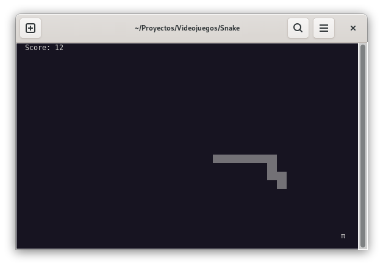

# Snake Game

A simple console-based Snake game implemented in Python using the curses library.



## Getting Started

### Prerequisites

- Python 3.x

### Installation

1. Clone the repository:

```bash
	git clone https://codeberg.org/betazetadev/snake-game.git
```

2. Navigate to the project directory:

```bash
	cd snake-game
```

3. Run the game:

```bash
	python snake.py
```

### Gameplay

* Use the arrow keys to control the direction of the snake.
* Eat the food (represented by π) to grow the snake and increase your score.
* Avoid running into the walls or colliding with the snake's body.
* The game ends when you hit a wall or collide with the snake's body.

### Features

* Score tracking.
* Increasing speed as the score goes up.
* Game over screen with the final score.

### License

This project is licensed under the MIT License - see the LICENSE file for details.

[](https://www.buymeacoffee.com/betazetadev "Buy me a coffee if you liked it")
